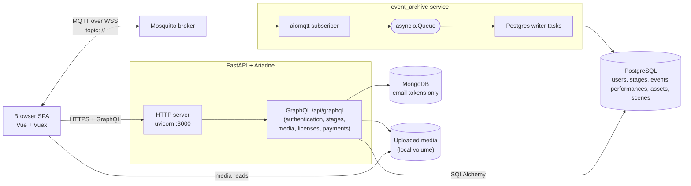
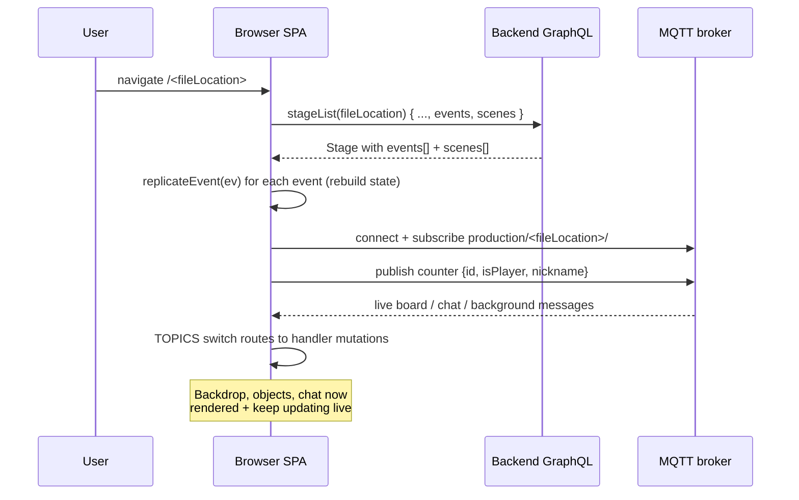
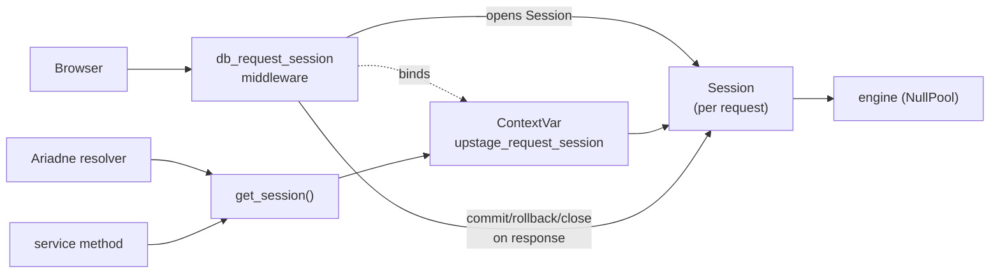
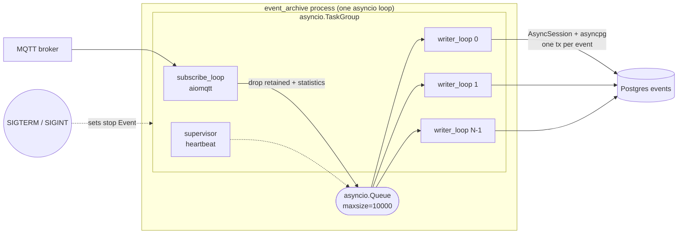

# UpStage Developer Guide

A working developer's map of how UpStage fits together: the public interfaces, the runtime flows, and where to look in the code for each concern. Every section cites real files so you can jump straight to the source.

## 1. What UpStage is

UpStage is a browser-based cyberformance platform: players perform live on a shared stage that audience members watch in real time. A stage has a backdrop, scene objects (avatars, props, video, audio, chat, drawings), and a live message bus that keeps every connected participant in sync.

Technically, UpStage is three cooperating runtimes:

| Runtime | Purpose | Lives in |
|---|---|---|
| Frontend SPA | Vue 3 + Vuex UI for players and audience, talks GraphQL + MQTT over WebSocket | [`prod_copy/upstage_frontend/`](upstage_frontend/) |
| HTTP / GraphQL backend | FastAPI + Ariadne schema, JWT auth, media storage, stage CRUD, recording | [`prod_copy/upstage_backend/src/`](upstage_backend/src/) |
| Event archive worker | Async MQTT subscriber that persists live events into Postgres | [`prod_copy/upstage_backend/src/event_archive/`](upstage_backend/src/event_archive/) |

Infrastructure: Mosquitto (MQTT broker), Postgres (primary data store, including the live event log), MongoDB (email-token collection only), and an object/file store for uploaded media.

## 2. System architecture



Two transport channels exist between the browser and the server:

- GraphQL over HTTP: everything durable (users, stages, assets, scenes, performances, config, payments, recording start/stop).
- MQTT over WebSocket: every live, per-message interaction (chat, board objects, backdrop, audio, reactions, drawings). The broker fans out in real time; the `event_archive` service tees a copy into Postgres so reloads can replay state.

## 3. Services and deployment

The backend compose file declares three app services that share one network:

```50:112:upstage_backend/app_containers/docker-compose-dev.yaml
services:
  upstage_backend_dev:
    image: registry.access.redhat.com/ubi9/python-312:latest
    ...
    command: >
      /bin/bash -c "
      cd /usr/app &&
      export PYTHONPATH=$(pwd)/src &&
      pip install --upgrade pip &&
      pip install -r ./requirements.txt &&
      export HARDCODED_HOSTNAME=${HARDCODED_HOSTNAME} &&
      ./scripts/start_upstage.sh"

  upstage_event_archive_dev:
    ...
    command: >
      /bin/bash -c "
      cd /usr/app &&
      ...
      python3 -m scripts.run_event_archive"

  upstage_stats_dev:
    ...
      python3 -m scripts.run_upstage_stats"
```

[`upstage_backend/scripts/start_upstage.sh`](upstage_backend/scripts/start_upstage.sh) pins it together:

```1:5:upstage_backend/scripts/start_upstage.sh
uvicorn src.main:app --proxy-headers --forwarded-allow-ips='*' --host 0.0.0.0 --port 3000
```

The ASGI app is defined in [`upstage_backend/src/main.py`](upstage_backend/src/main.py):

```45:67:upstage_backend/src/main.py
def start_app():
    bootstrap = Bootstrap(app)
    add_cors_middleware(app)
    config_graphql_endpoints(app)
    bootstrap.init_exception()


app = FastAPI(title="upstage", lifespan=lifespan)
GlobalVariable.set("app", app)


@app.middleware("http")
async def no_store_api_responses(request: Request, call_next):
    """Prevent CDN/browser caching of dynamic API responses (e.g. Cloudflare POST cache rules)."""
    response = await call_next(request)
    path = request.url.path
    if path.startswith("/api/"):
        response.headers["Cache-Control"] = "private, no-store, must-revalidate"
        response.headers["Pragma"] = "no-cache"
    return response
```

### Backend module layout

Every folder under `upstage_backend/src/` is a bounded context. They all expose their schema via `global_config.config_graphql_endpoints` so the overall GraphQL tree is composed from per-module slices.

| Module | Responsibility |
|---|---|
| [`authentication/`](upstage_backend/src/authentication/) | JWT-based login, password reset, user registration helpers |
| [`users/`](upstage_backend/src/users/) | User CRUD, roles, licences association |
| [`stages/`](upstage_backend/src/stages/) | Stage CRUD, join/load, event replay, sweep, duplicate, scenes |
| [`assets/`](upstage_backend/src/assets/) | Media catalogue, asset usage, copyright levels |
| [`files/`](upstage_backend/src/files/) | Upload handling, thumbnails |
| [`mails/`](upstage_backend/src/mails/) | System email, email-token Mongo collection |
| [`licenses/`](upstage_backend/src/licenses/) | Licence keys, access checks |
| [`payments/`](upstage_backend/src/payments/) | Stripe integration |
| [`performance_config/`](upstage_backend/src/performance_config/) | Performances (archived stage snapshots) and recordings |
| [`studio_management/`](upstage_backend/src/studio_management/) | Umbrella GraphQL schema and top-level `Query` / `Mutation` wiring |
| [`upstage_options/`](upstage_backend/src/upstage_options/) | Runtime options / config table |
| [`upstage_stats/`](upstage_backend/src/upstage_stats/) | Separate process for aggregating statistics events |
| [`event_archive/`](upstage_backend/src/event_archive/) | Async MQTT-to-Postgres event persistence (this guide's section 8) |
| [`global_config/`](upstage_backend/src/global_config/) | DB engine, env vars, loggers, shared base model, JWT decorator |
| [`main.py`](upstage_backend/src/main.py) | FastAPI entrypoint, CORS, cache headers |

### Frontend module layout

[`upstage_frontend/src/`](upstage_frontend/src/):

| Area | Role |
|---|---|
| `views/` | Top-level routed pages (stage, foyer, workshop, admin) |
| `components/` | Reusable Vue components: stage objects, chat, avatar, tools |
| `store/modules/stage/` | Vuex module that owns live stage state + MQTT handlers |
| `services/graphql/` | Typed GraphQL client calls (via graphql-request) |
| `services/mqtt.ts` | Thin MQTT client wrapper over `mqtt.js` |
| `models/` | TypeScript types for stages, users, assets |
| `utils/constants.ts` | Shared enums: `TOPICS`, `BACKGROUND_ACTIONS`, `ROLES`, `COLORS` |
| `config.ts` | Runtime URLs and MQTT namespace |
| `i18n/` | Translations |
| `router.ts` | Vue Router wiring |

## 4. Public interfaces

### 4.1 GraphQL endpoint

Exposed at `/api/graphql` on the backend, with the schema composed in [`upstage_backend/src/studio_management/http/graphql.py`](upstage_backend/src/studio_management/http/graphql.py). It contains one root `Query`, one root `Mutation`, and shared type definitions like `Stage`, `Event`, `Performance`, `Asset`, `User`, `Scene`, and `License`.

Representative mutations (see [`upstage_backend/src/studio_management/http/graphql.py`](upstage_backend/src/studio_management/http/graphql.py) lines 632-690):

```632:691:upstage_backend/src/studio_management/http/graphql.py
type Mutation {
    batchUserCreation(users: [BatchUserInput]!): BatchUserCreationPayload
    updateUser(input: UpdateUserInput!): User
    deleteUser(id: ID!): CommonResponse
    uploadFile(base64: String!, filename: String!): File!
    saveMedia(input: SaveMediaInput!): SaveMediaPayload!
    ...
    createUser(inbound: CreateUserInput!): CreateUserPayload
    requestPasswordReset(email: String!): CommonResponse
    resetPassword(input: ResetPasswordInput!): CommonResponse
    login(payload: LoginInput!): TokenType
    ...
    createStage(input: StageInput!): Stage
    updateStage(input: StageInput!): Stage
    duplicateStage(id: ID!, name: String!): Stage
    deleteStage(id: ID!): CommonResponse
    assignMedia(input: AssignMediaInput!): Stage
    uploadMedia(input: UploadMediaInput!): Asset
    ...
    sweepStage(id: ID!): SweepResponse
    saveScene(input: SceneInput!): Scene
    startRecording(input: RecordInput!): Performance
    saveRecording(id: ID!): Performance
    updateStatus(id: ID!): UpdateStageResponse
    updateVisibility(id: ID!): UpdateStageResponse
}
```

Representative queries (lines 695-730):

```695:730:upstage_backend/src/studio_management/http/graphql.py
type Query {
    ...
    media(input: MediaTableInput!): AssetConnection!
    mediaList(mediaType: String, owner: String): [Asset!]!
    users(active: Boolean): [User!]!
    access(path: String!): License!
    stages(input: SearchStageInput): StagesResponse
    stage(id: ID!): Stage
    stageList(input: StageStreamInput): [Stage!]!
    ...
}
```

The `Stage` type embeds live event data so a single `stageList` query reconstructs everything needed to render a stage:

```339:355:upstage_backend/src/studio_management/http/graphql.py
status: String
visibility: Boolean
cover: String
description: String
playerAccess: String
permission: String
owner: User
assets: [Asset]
chats: [Event]
events: [Event]
scenes: [Scene]
lastAccess: Date
createdOn: Date
attributes:[StageAttribute]
performances: [Performance]
```

#### Example: log in

```graphql
mutation Login($payload: LoginInput!) {
  login(payload: $payload) {
    accessToken
    refreshToken
    user { id nickname roles }
  }
}
```

```json
{ "payload": { "username": "helen", "password": "Secret@123" } }
```

Frontend call: [`upstage_frontend/src/services/graphql/user.ts`](upstage_frontend/src/services/graphql/user.ts).

#### Example: create a stage

```graphql
mutation CreateStage($input: StageInput!) {
  createStage(input: $input) { id fileLocation name }
}
```

Client-side, see [`upstage_frontend/src/services/graphql/stage.ts`](upstage_frontend/src/services/graphql/stage.ts) lines 85-110.

#### Example: load a stage for rendering

```graphql
query Load($fileLocation: String, $performanceId: Int) {
  stageList(input: { fileLocation: $fileLocation, performanceId: $performanceId }) {
    id name fileLocation permission
    assets { id fileLocation }
    scenes { id name order }
    events { id topic payload mqttTimestamp }
  }
}
```

Frontend code: [`upstage_frontend/src/services/graphql/stage.ts`](upstage_frontend/src/services/graphql/stage.ts) line 229 (`loadStage`) and line 293 (`loadEvents` for cursor-based incremental reload).

### 4.2 MQTT topics

All live interactions travel over MQTT. Topic names are formed by `namespaceTopic` in [`upstage_frontend/src/store/modules/stage/reusable.ts`](upstage_frontend/src/store/modules/stage/reusable.ts):

```47:51:upstage_frontend/src/store/modules/stage/reusable.ts
export function namespaceTopic(topicName, stageUrl) {
  const url = stageUrl ?? store.getters["stage/url"];
  const namespace = configs.MQTT_NAMESPACE;
  return `${namespace}/${url}/${topicName}`;
}
```

So for `namespace="production"` and `stageUrl="hentest"` the board topic is `production/hentest/board`. Each stage has its own private namespace; clients subscribe to the topics they care about when joining.

The topic and action enums are in [`upstage_frontend/src/utils/constants.ts`](upstage_frontend/src/utils/constants.ts):

```2:43:upstage_frontend/src/utils/constants.ts
export const TOPICS = {
  CHAT: "chat",
  BOARD: "board",
  BACKGROUND: "background",
  AUDIO: "audio",
  REACTION: "reaction",
  COUNTER: "counter",
  DRAW: "draw",
  STATISTICS: "statistics",
};

export const BOARD_ACTIONS = {
  PLACE_OBJECT_ON_STAGE: "placeObjectOnStage",
  MOVE_TO: "moveTo",
  DESTROY: "destroy",
  SWITCH_FRAME: "switchFrame",
  SPEAK: "speak",
  SEND_TO_BACK: "sendToBack",
  BRING_TO_FRONT: "bringToFront",
  BRING_TO_FRONT_OF: "bringToFrontOf",
  TOGGLE_AUTOPLAY_FRAMES: "toggleAutoplayFrames",
};

export const BACKGROUND_ACTIONS = {
  CHANGE_BACKGROUND: "changeBackground",
  SET_CHAT_VISIBILITY: "setChatVisibility",
  SET_REACTION_VISIBILITY: "setReactionVisibility",
  CLEAR_CHAT: "clearChat",
  SET_CHAT_POSITION: "setChatPosition",
  SET_BACKDROP_COLOR: "setBackdropColor",
  DRAW_CURTAIN: "drawCurtain",
  LOAD_SCENES: "loadScenes",
  SWITCH_SCENE: "switchScene",
  BLANK_SCENE: "blankScene",
  SET_DARK_MODE_CHAT: "setDarkModeChat",
};

export const DRAW_ACTIONS = {
  NEW_LINE: "newLine",
  UNDO: "undo",
  CLEAR: "clear",
};
```

Message shapes (the `payload` field in every `Event` row):

| Topic | Published when | Payload shape |
|---|---|---|
| `chat` | Any chat message | `{ id, nickname, text, at, color }` |
| `board` | Scene object created / moved / removed / reordered | `{ type: BOARD_ACTIONS.*, object, at }` |
| `background` | Backdrop image / chat visibility / scene switch | `{ type: BACKGROUND_ACTIONS.*, background?, scene?, at }` |
| `audio` | Audio track start / stop / seek | `{ id, action, position?, at }` |
| `reaction` | Audience emoji reaction | `{ emoji, at }` |
| `counter` | Join / leave heartbeat | `{ id, isPlayer, nickname, at, avatarId }` |
| `draw` | Drawing stroke append / undo / clear | `{ type: DRAW_ACTIONS.*, line?, at }` |
| `statistics` | Periodic presence stats | `{ players, audiences }` (not persisted) |

The backend's event archive preserves these payloads unchanged as JSON (see section 8).

Example backdrop change published by the frontend: [`upstage_frontend/src/store/modules/stage/index.ts`](upstage_frontend/src/store/modules/stage/index.ts) line 1018:

```1018:1022:upstage_frontend/src/store/modules/stage/index.ts
mqtt.sendMessage(TOPICS.BACKGROUND, {
  type: BACKGROUND_ACTIONS.CHANGE_BACKGROUND,
  background,
});
```

### 4.3 HTTP

- `POST /api/graphql` — the sole GraphQL endpoint. The middleware in [`upstage_backend/src/main.py`](upstage_backend/src/main.py) lines 56-64 sets `Cache-Control: private, no-store, must-revalidate` on every `/api/*` response so proxies and browsers never cache authenticated responses.
- CORS allows any origin in non-production, locked down to the configured `HOSTNAME` in production (lines 26-34).
- Uploaded media are served statically from the `uploads/` volume (see [`docker-compose-dev.yaml`](upstage_backend/app_containers/docker-compose-dev.yaml) line 63).

## 5. How key flows work

### 5.1 Join a stage and render



Code path:

1. [`upstage_frontend/src/services/graphql/stage.ts`](upstage_frontend/src/services/graphql/stage.ts) line 229: `loadStage(fileLocation, performanceId)` fetches everything at once.
2. [`upstage_frontend/src/store/modules/stage/index.ts`](upstage_frontend/src/store/modules/stage/index.ts) `joinStage` action wires the local state, subscribes to the stage topic namespace, and replays events:
   ```ts
   events.forEach((event) => dispatch("replicateEvent", event));
   ```
   (line 1214, inside `reloadMissingEvents`).
3. The `onMessage` handler switches on `TOPICS.*`:
   ```738:779:upstage_frontend/src/store/modules/stage/index.ts
   [TOPICS.CHAT]: { qos: 2 },
   [TOPICS.BOARD]: { qos: 2 },
   [TOPICS.BACKGROUND]: { qos: 2 },
   [TOPICS.AUDIO]: { qos: 2 },
   [TOPICS.REACTION]: { qos: 2 },
   [TOPICS.COUNTER]: { qos: 2 },
   [TOPICS.DRAW]: { qos: 2 },
   ```
   Each branch dispatches the matching handler action (`handleChatMessage`, `handleBoardMessage`, `handleBackgroundMessage`, etc.).
4. State mutations (e.g. `SET_BACKGROUND`) drive Vue reactivity; components in `components/stage/*.vue` re-render.

### 5.2 Publish a live interaction

Example: dropping an avatar onto the stage.

```908:914:upstage_frontend/src/store/modules/stage/index.ts
mqtt.sendMessage(TOPICS.BOARD, {
  type: BOARD_ACTIONS.PLACE_OBJECT_ON_STAGE,
  object,
  at: +new Date(),
});
```

The MQTT client lives at [`upstage_frontend/src/services/mqtt.ts`](upstage_frontend/src/services/mqtt.ts). `sendMessage(topic, payload)` calls `namespaceTopic` and publishes non-retained JSON. Every subscriber (other browsers) immediately receives the same message and the `event_archive` service (section 8) tees it into Postgres.

### 5.3 Authentication

[`upstage_backend/src/authentication/services/auth.py`](upstage_backend/src/authentication/services/auth.py) implements JWT login and token refresh. The `@authenticated` decorator in [`upstage_backend/src/global_config/decorators/authenticated.py`](upstage_backend/src/global_config/decorators/authenticated.py) guards resolvers; the frontend stores tokens and injects them via [`upstage_frontend/src/apollo.ts`](upstage_frontend/src/apollo.ts) (Apollo client) or `graphql-request` wrappers per module.

### 5.4 Media upload and assignment

1. Browser base64-encodes the file and calls `uploadMedia(input: UploadMediaInput!)` or `uploadFile(base64, filename)`.
2. [`upstage_backend/src/stages/services/media.py`](upstage_backend/src/stages/services/media.py) writes to `uploads/` (see `_get_physical_path`, lines 226-230).
3. `AssetModel` rows record filename, copyright level, owner.
4. `assignMedia` / `assignStages` cross-link an asset to a stage.

### 5.5 Sweep and performances

A "performance" is an archived snapshot of a stage's live event stream, created by the `sweepStage` mutation. See [`upstage_backend/src/stages/services/stage.py`](upstage_backend/src/stages/services/stage.py):

```460:489:upstage_backend/src/stages/services/stage.py
def sweep_stage(self, user: UserModel, id: int):
    session = get_session()
    stage = (
        session.query(StageModel).filter(StageModel.id == id).first()
    )
    if not stage:
        raise GraphQLError("Stage not found")

    events = (
        session.query(EventModel)
        .filter(EventModel.performance_id == None)
        .filter(EventModel.topic.ilike("%/{}/%".format(stage.file_location)))
    )

    if events.count() > 0:
        performance = PerformanceModel(stage_id=stage.id)

        session.add(performance)
        session.flush()

        events.update(
            {EventModel.performance_id: performance.id},
            synchronize_session="fetch",
        )
    else:
        raise GraphQLError("The stage is already sweeped!")
```

`get_session()` returns the request-scoped SQLAlchemy `Session` that the FastAPI middleware opened at the start of this GraphQL call (see section 7). The method no longer calls `.commit()`; the middleware commits on clean request exit and rolls back on any exception.

Mechanism:

- Before sweep: live events have `performance_id = NULL`. `stageList { events }` with no `performanceId` returns them and the stage renders with full live state.
- During sweep: all matching NULL rows are bulk-assigned a new `PerformanceModel.id`.
- After sweep: the live view sees zero rows (fresh stage). Operators can replay the archive by calling `stageList(input: { fileLocation, performanceId })`.

Event reads always come from Postgres, see [`upstage_backend/src/stages/services/stage_operation.py`](upstage_backend/src/stages/services/stage_operation.py):

```91:102:upstage_backend/src/stages/services/stage_operation.py
def get_event_list(self, input: StageStreamInput, stage: StageModel):
    session = get_session()
    cursor = input.cursor if input.cursor else 0
    events = (
        session.query(EventModel)
        .filter(EventModel.performance_id == input.performanceId)
        .filter(EventModel.topic.like("%/{}/%".format(stage.file_location)))
        .filter(EventModel.id > cursor)
        .order_by(EventModel.mqtt_timestamp.asc())
        .all()
    )
    return [convert_keys_to_camel_case(event.to_dict()) for event in events]
```

### 5.6 Recording

`startRecording` creates a performance row and flags recording mode; subsequent live events are still archived but the frontend also marks the session on the performance. `saveRecording` finalises the row. See [`upstage_backend/src/performance_config/services/performance.py`](upstage_backend/src/performance_config/services/performance.py).

## 6. Data model

All tables share [`upstage_backend/src/global_config/db_models/base.py`](upstage_backend/src/global_config/db_models/base.py)'s `BaseModel`.

| Table | Module | Key columns | Purpose |
|---|---|---|---|
| `users` | `users/db_models/user.py` | id, username, password_hash, nickname, roles | Account + role-based auth |
| `stages` | `stages/db_models/stage.py` | id, name, file_location (url slug), owner_id, last_access, visibility | Stage metadata |
| `stage_attributes` | `stages/db_models/` | stage_id, name, description | Flexible stage flags (`visibility`, `playerAccess`, ...) |
| `performances` | `performance_config/db_models/` | id, stage_id, created | One per sweep / recording |
| `events` | `event_archive/db_models/event.py` | id, topic, payload (JSON), mqtt_timestamp, performance_id, created | Every live MQTT message |
| `assets` | `assets/db_models/` | id, file_location, owner_id, copyright_level | Uploaded media catalogue |
| `asset_usage` | `assets/db_models/` | asset_id, user_id, approved | Permission requests |
| `scenes` | `stages/db_models/` | id, stage_id, scene_order, active | Named backdrop presets |
| `licenses` | `licenses/db_models/` | id, key, owner_id, expires | Paid licences |

The `EventModel` is the only row any writer (live archive) or reader (stage load, sweep) of the event log ever touches:

```21:28:upstage_backend/src/event_archive/db_models/event.py
class EventModel(BaseModel):
    __tablename__ = "events"
    id = Column(Integer, primary_key=True)
    topic = Column(String)
    mqtt_timestamp = Column(Float, index=True)
    performance_id = Column(Integer, index=True)
    payload = Column(postgresql.JSON)
    created = Column(DateTime, default=datetime.datetime.now, index=True)
```

MongoDB is used only for time-expiring email verification tokens; see [`upstage_backend/src/event_archive/config/mongodb.py`](upstage_backend/src/event_archive/config/mongodb.py) `build_mongo_email_client` / `get_mongo_token_collection` (used by [`upstage_backend/src/mails/helpers/mail.py`](upstage_backend/src/mails/helpers/mail.py) line 49).

## 7. Database session management (hybrid contextvar model)

UpStage uses a two-track session strategy so that every DB touch has exactly one owner of its commit/rollback/close, regardless of whether it happens inside an HTTP request or in a long-running worker/script.

### 7.1 Track A: request-scoped session (HTTP + GraphQL)



- The FastAPI middleware in [`upstage_backend/src/main.py`](upstage_backend/src/main.py) wraps every HTTP request in `request_session()` from [`src/global_config/db_context.py`](upstage_backend/src/global_config/db_context.py). That context manager calls `SessionFactory()`, binds the resulting `Session` on a `ContextVar`, commits on clean exit, rolls back on exception, and always closes.
- The Ariadne `context_value` builder in [`src/global_config/schema.py`](upstage_backend/src/global_config/schema.py) pulls the same session off the contextvar and exposes it as `info.context["db"]` for resolvers that prefer that style.
- Every service method and resolver body reads the session with:

  ```python
  from global_config import get_session
  session = get_session()
  stages = session.query(StageModel).filter(...).all()
  ```

- Services do **not** call `.commit()` themselves. `.flush()` is kept only where an auto-generated ID is needed in the same request (e.g. creating a `PerformanceModel` then bulk-updating rows with its new `id`).
- `SessionFactory` uses `expire_on_commit=False`, so ORM instances remain attached and `lazy="dynamic"` relationships (`StageModel.attributes/assets`, `AssetModel.parent_stages/tags/usages`) and `@hybrid_property` accessors (`StageModel.cover/visibility/status`) stay queryable for the entire response serialization. This is what eliminates the `Instance <StageModel> is detached, dynamic relationship cannot return a correct result` warnings by construction.
- A dev/prod safety net: `get_session()` raises `RuntimeError` if no session is bound to the contextvar. Toggle with the env var `STRICT_DB_CONTEXT=0` (only the test suite sets this). The middleware also emits a warning log if a request ends with a dirty session, which indicates a missed `.flush()` or a resolver that leaked objects past its commit point.

### 7.2 Track B: explicit scope (scripts, workers, background tasks)

Anything that is not inside a request uses the context-manager `ScopedSession` from [`src/global_config/database.py`](upstage_backend/src/global_config/database.py):

```python
from global_config.database import ScopedSession

with ScopedSession() as s:
    user = UserModel(username="alice", ...)
    s.add(user)
    # commit + close happen on normal exit;
    # rollback + close happen if the block raises.
```

Used by:

- Dev/seed scripts: [`src/users/scripts/create_test_users.py`](upstage_backend/src/users/scripts/create_test_users.py), [`src/stages/scripts/scaffold_base_media.py`](upstage_backend/src/stages/scripts/scaffold_base_media.py), [`scripts/devtools/wipe_dev.py`](upstage_backend/scripts/devtools/wipe_dev.py).
- Stats worker: [`src/upstage_stats/mqtt.py`](upstage_backend/src/upstage_stats/mqtt.py) opens a fresh `ScopedSession` per persisted stat, because the `paho-mqtt` callbacks are not in a request.
- Background email tasks: [`src/mails/helpers/mail.py`](upstage_backend/src/mails/helpers/mail.py) uses `ScopedSession` because token sending runs in `asyncio.create_task` that can outlive the HTTP request that triggered it.

`ScopedSession` shares the same `SessionFactory` (and therefore the same engine config) as the request path, so test-harness overrides swap both at once.

### 7.3 Track C: async event archive

The `event_archive` service (section 8) is intentionally not part of either track above. It owns its own `AsyncSessionLocal` in [`src/event_archive/db.py`](upstage_backend/src/event_archive/db.py) because `aiomqtt` and `asyncpg` need the SQLAlchemy async API. One transaction per event, committed inside `async with session.begin():`. There is no contextvar bridge between the archive and the HTTP app.

### 7.4 `DBSession` deprecation alias

For the duration of the migration, `global_config.DBSession` still exists as a thin proxy that forwards every attribute access to `get_session()`. That keeps any call site that was missed in the refactor working without silently falling back to a module-level registry. It emits no warnings today, but new code must use `get_session()` directly; the proxy will be deleted in a follow-up cleanup.

### 7.5 Tests

[`tests/conftest.py`](upstage_backend/tests/conftest.py) rebinds `SessionFactory` to an in-memory SQLite engine, opens a single `Session`, pushes it on the contextvar via `set_session()`, and yields it as the `db_session` fixture (also exposed as `rebound_db["db_session"]`). The production code under test reads the exact same session through `get_session()`, and `ScopedSession()` in code-under-test reuses the same engine. Teardown resets the contextvar and truncates the tables.

---

## 8. The event archive (live-to-durable pipeline)

Every non-retained, non-statistics MQTT message is persisted to Postgres `events` so late-joining audience and post-sweep reloads see the correct stage state. The entire subsystem is a single async process under `asyncio.TaskGroup`.



Entrypoint: [`upstage_backend/scripts/run_event_archive.py`](upstage_backend/scripts/run_event_archive.py):

```26:34:upstage_backend/scripts/run_event_archive.py
from src.event_archive.main import main


if __name__ == "__main__":
    try:
        asyncio.run(main())
    except KeyboardInterrupt:
        sys.exit(0)
    except BaseException:
        sys.exit(1)
```

TaskGroup in [`upstage_backend/src/event_archive/main.py`](upstage_backend/src/event_archive/main.py):

```56:82:upstage_backend/src/event_archive/main.py
async def main() -> None:
    queue: asyncio.Queue = asyncio.Queue(maxsize=QUEUE_CAPACITY)
    stop = asyncio.Event()
    _install_signal_handlers(stop)

    ...

    try:
        async with asyncio.TaskGroup() as tg:
            tg.create_task(subscribe_loop(queue, stop), name="mqtt-subscriber")
            for i in range(WRITER_CONCURRENCY):
                tg.create_task(writer_loop(i, queue, stop), name=f"pg-writer-{i}")
            tg.create_task(_supervisor(queue, stop), name="supervisor")

            await stop.wait()
            try:
                await asyncio.wait_for(queue.join(), timeout=10.0)
            except asyncio.TimeoutError:
                ...
```

MQTT subscriber in [`upstage_backend/src/event_archive/subscriber.py`](upstage_backend/src/event_archive/subscriber.py):

```42:73:upstage_backend/src/event_archive/subscriber.py
async def subscribe_loop(queue: asyncio.Queue, stop: asyncio.Event) -> None:
    while not stop.is_set():
        try:
            async with aiomqtt.Client(
                hostname=MQTT_BROKER,
                port=MQTT_ADMIN_PORT,
                username=MQTT_ADMIN_USER,
                password=MQTT_ADMIN_PASSWORD,
                transport=MQTT_TRANSPORT,
                keepalive=KEEPALIVE_SECONDS,
                identifier=_client_id(),
            ) as client:
                await client.subscribe(PERFORMANCE_TOPIC_RULE)
                ...
                async for msg in client.messages:
                    if stop.is_set():
                        break
                    if getattr(msg, "retain", False):
                        continue
                    topic = msg.topic.value
                    if topic.endswith("statistics"):
                        continue
                    await queue.put(
                        {
                            "topic": topic,
                            "payload": msg.payload,
                            "ts": time.time(),
                        }
                    )
```

Postgres writer in [`upstage_backend/src/event_archive/writer.py`](upstage_backend/src/event_archive/writer.py):

```73:94:upstage_backend/src/event_archive/writer.py
            try:
                async with AsyncSessionLocal() as session:
                    async with session.begin():
                        session.add(
                            EventModel(
                                topic=topic,
                                payload=payload,
                                mqtt_timestamp=ts,
                            )
                        )
            except Exception:
                logger.exception(
                    f"event_archive: writer {worker_id} failed to persist "
                    f"topic={topic!r} ts={ts}"
                )
            finally:
                queue.task_done()
```

Runtime tunables (all optional env vars):

| Env var | Default | Role |
|---|---:|---|
| `EVENT_ARCHIVE_WRITERS` | 4 | Concurrent Postgres writer tasks |
| `EVENT_ARCHIVE_QUEUE_CAPACITY` | 10000 | Back-pressure threshold |
| `EVENT_ARCHIVE_HEARTBEAT_SECONDS` | 30 | Queue-depth log cadence |
| `EVENT_ARCHIVE_RECONNECT_DELAY` | 2.0 | Seconds after an MQTT disconnect |
| `EVENT_ARCHIVE_MQTT_KEEPALIVE` | 30 | MQTT keepalive |
| `EVENT_ARCHIVE_DB_POOL_SIZE` | 5 | Async SQLAlchemy pool |
| `EVENT_ARCHIVE_DB_MAX_OVERFLOW` | 5 | Pool overflow |

Key properties: any exception escapes the TaskGroup and exits non-zero so Docker restarts the container; `queue.put()` awaits when full so MQTT flow-controls naturally; each event is wrapped in its own transaction so one bad payload cannot poison the next.

## 9. Running the stack locally

Prereqs: Docker + docker compose, a `.env` file with the database and MQTT credentials (see [`upstage_backend/initial_scripts/environments/env_app_template.py`](upstage_backend/initial_scripts/environments/env_app_template.py) for the full list), and an external network `upstage-network-dev`.

```bash
# From the repo root:
cd prod_copy/upstage_backend/app_containers
docker compose -f docker-compose-dev.yaml up -d
# Three app containers plus whatever you run for Postgres, Mongo, MQTT
cd ../../upstage_frontend
npm ci && npm run dev     # Vite dev server against the backend
```

The frontend's [`upstage_frontend/src/config.ts`](upstage_frontend/src/config.ts) resolves `GRAPHQL_ENDPOINT`, `STATIC_ASSETS_ENDPOINT`, `MQTT_ENDPOINT`, and `MQTT_NAMESPACE` at runtime from `window.__UPSTAGE_CONFIG__` (or fallbacks for dev).

Useful scripts:

- [`upstage_backend/scripts/start_upstage.sh`](upstage_backend/scripts/start_upstage.sh) — uvicorn launcher.
- [`upstage_backend/scripts/run_event_archive.py`](upstage_backend/scripts/run_event_archive.py) — async archive worker.
- [`upstage_backend/scripts/run_upstage_stats.py`](upstage_backend/scripts/run_upstage_stats.py) — stats aggregator.
- [`upstage_backend/create-migration.sh`](upstage_backend/create-migration.sh) — alembic revision helper; migrations live per-module in `*/db_migrations/`.

## 10. Where to look for what

Quick reference for common tasks.

| I want to... | Look here |
|---|---|
| Add a new MQTT interaction | Add a constant to [`utils/constants.ts`](upstage_frontend/src/utils/constants.ts), dispatch/handle in [`store/modules/stage/index.ts`](upstage_frontend/src/store/modules/stage/index.ts); nothing to change server-side because the archive persists any new topic matching `PERFORMANCE_TOPIC_RULE` |
| Add a new GraphQL query/mutation | Schema SDL in the relevant module's `http/graphql.py`, resolver wiring in `http/schema.py`, business logic in `services/*.py`; then expose via [`studio_management/http/graphql.py`](upstage_backend/src/studio_management/http/graphql.py) if it's not already |
| Add a column to `events` | Extend [`upstage_backend/src/event_archive/db_models/event.py`](upstage_backend/src/event_archive/db_models/event.py), create an alembic migration in [`event_archive/db_migrations/`](upstage_backend/src/event_archive/db_migrations/), update [`event_archive/writer.py`](upstage_backend/src/event_archive/writer.py) to set it, update the GraphQL `Event` type |
| Debug "stage looks blank" | Check `events.payload` in Postgres for the stage (`topic LIKE '%/<fileLocation>/%' AND performance_id IS NULL`); if zero rows, inspect the `event_archive` container logs for subscriber errors; confirm MQTT broker reachable |
| Add a new backend service | Copy the `upstage_event_archive_dev` stanza in [`docker-compose-dev.yaml`](upstage_backend/app_containers/docker-compose-dev.yaml) |
| Change what's served as static assets | `uploads/` volume in the backend container; served via the reverse proxy |
| Add a role or permission | [`utils/constants.ts`](upstage_frontend/src/utils/constants.ts) `ROLES` + [`global_config/decorators/authenticated.py`](upstage_backend/src/global_config/decorators/authenticated.py) |

## 11. Glossary

| Term | Meaning |
|---|---|
| Stage | A persistent URL slug (`file_location`) that players and audience can visit; has a backdrop, scenes, board, chat |
| File location | The URL-safe slug used in the route `/<file_location>` and in MQTT topic namespacing |
| Player | Authenticated user with permission to drive action on a stage |
| Audience | Unauthenticated or non-player viewer |
| Performance | An archived snapshot of event history; created by sweep or recording |
| Sweep | The mutation that atomically moves all live events for a stage into a new performance; see [`stages/services/stage.py`](upstage_backend/src/stages/services/stage.py) `sweep_stage` |
| Board | The live canvas on which avatars / media objects are placed; object metadata travels on the `board` MQTT topic |
| Scene | A reusable "preset" of backdrop + board objects, selectable via `BACKGROUND_ACTIONS.SWITCH_SCENE` |
| Namespace | The MQTT topic prefix (`production/`, `staging/`, ...) configured by `MQTT_NAMESPACE` |
| Retained | An MQTT flag we explicitly do NOT use: the archive ignores retained messages on purpose, relying on the event log for replay instead |
