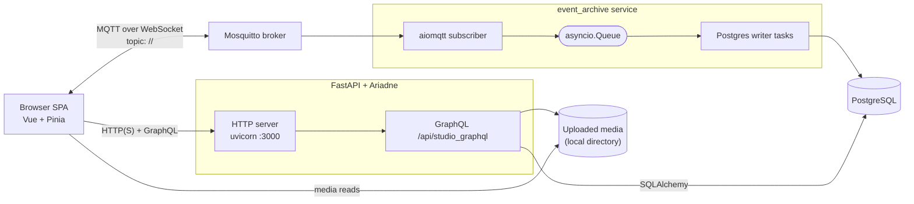
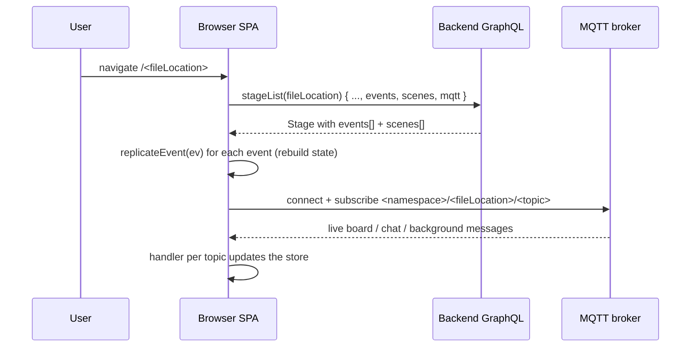
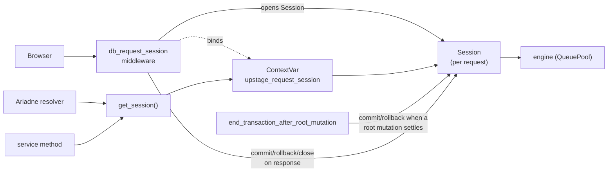
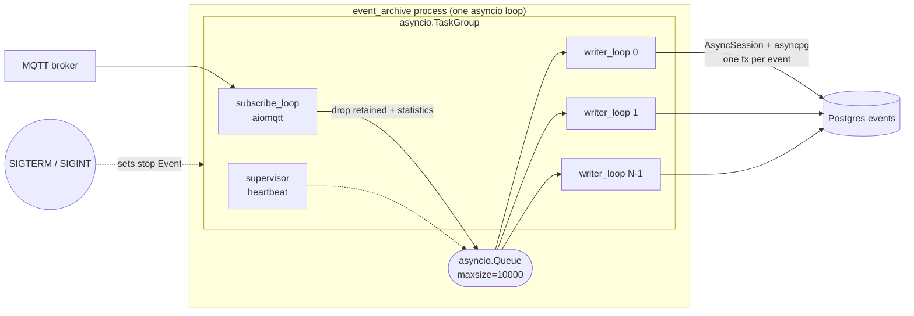

# UpStage Developer Guide

A working developer's map of how UpStage fits together: the public interfaces, the runtime flows, and where to look in the code for each concern. Paths are relative to this repository's root unless they start with `../upstage_frontend/` (the sibling frontend repository). Files are cited by path and function/class name, not by line number.

## 1. What UpStage is

UpStage is a browser-based cyberformance platform: players perform live on a shared stage that audience members watch in real time. A stage has a backdrop, scene objects (avatars, props, video, audio, chat, drawings), and a live message bus that keeps every connected participant in sync.

Technically, UpStage is these cooperating runtimes:

| Runtime | Purpose | Lives in |
|---|---|---|
| Frontend SPA | Vue 3 + Pinia UI for players and audience, talks GraphQL over HTTP and MQTT over WebSocket | [`../upstage_frontend/`](../upstage_frontend/) |
| HTTP / GraphQL backend | FastAPI + Ariadne schema, JWT auth, media storage, stage CRUD, recording | [`src/upstage_backend/`](src/upstage_backend/) |
| Event archive worker | Async MQTT subscriber that persists live events into Postgres | [`src/upstage_backend/event_archive/`](src/upstage_backend/event_archive/) |
| Stats worker | MQTT subscriber that persists connection and audience/player statistics | [`src/upstage_backend/upstage_stats/`](src/upstage_backend/upstage_stats/) |

Infrastructure: Mosquitto (MQTT broker), Postgres (primary data store, including the live event log), and a local directory for uploaded media.

## 2. System architecture


```mermaid
flowchart LR
  Browser["Browser SPA<br/>Vue + Pinia"]

  subgraph backend ["FastAPI + Ariadne"]
    HTTP["HTTP server<br/>uvicorn :3000"]
    GQL["GraphQL /api/studio_graphql"]
    HTTP --> GQL
  end

  MQTT["Mosquitto broker"]

  subgraph archive ["event_archive service"]
    Sub["aiomqtt subscriber"]
    Q(["asyncio.Queue"])
    Wr["Postgres writer tasks"]
  end

  PG[("PostgreSQL")]
  Files[("Uploaded media<br/>(local directory)")]

  Browser -->|"HTTP(S) + GraphQL"| HTTP
  Browser <-->|"MQTT over WebSocket<br/>topic: <namespace>/<stageUrl>/<topic>"| MQTT
  MQTT --> Sub --> Q --> Wr --> PG
  GQL -->|"SQLAlchemy"| PG
  GQL --> Files
  Browser -->|"media reads"| Files
```

Two transport channels exist between the browser and the server:

- GraphQL over HTTP: everything durable (users, stages, assets, scenes, performances, config, payments, recording start/stop). There is no GraphQL WebSocket route and the schema has no `Subscription` type.
- MQTT over WebSocket: every live, per-message interaction. The broker fans out in real time; the `event_archive` service tees a copy into Postgres so reloads can replay state.

## 3. Services and deployment

### 3.0. Local setup: one editable install

The backend is a standard src-layout Python package, declared in [`pyproject.toml`](pyproject.toml). Once per workstation:

```bash
pip install -e .
```

That makes `upstage_backend` importable from any directory, so `uvicorn upstage_backend.main:app`, `pytest`, `alembic`, and `python3 -m scripts.run_event_archive` work with no `PYTHONPATH` exports. `requirements.txt` contains the single line `-e .`; the dependency list lives in `pyproject.toml`.

Versions:

- `requires-python` is `>=3.12` (the lower bound for host virtualenvs).
- The container image is built from `python:3.14-slim-trixie` by the inline Dockerfile in [`app_containers/docker-compose.yaml`](app_containers/docker-compose.yaml) (`x-common-build`): the builder stage runs `uv sync --frozen --no-dev --no-install-project` (falling back to an unfrozen sync) to populate `/usr/app/.venv`, and the runtime stage runs `pip install --no-deps --no-cache-dir -e .`.
- CI ([`.github/workflows/ci.yml`](.github/workflows/ci.yml)) uses Python 3.14 with `postgres:latest` and `eclipse-mosquitto:latest` service containers.
- SQLAlchemy is `sqlalchemy[asyncio]>=2.1`. SQLAlchemy 2.1 defaults to the psycopg (v3) driver for `postgresql://` URLs; `with_psycopg2_driver()` in `global_config/env.py` rewrites the URL to name `psycopg2` explicitly.
- The baseline schema (`alembic/versions/baseline001_schema.sql`) was dumped from PostgreSQL 18 and sets `transaction_timeout`, so it needs PostgreSQL 17 or newer.

Lint: `ruff` with rules `E`, `F`, `B`, `DTZ`, `RUF006`, `ASYNC` selected and `E501` ignored (`[tool.ruff.lint]` in `pyproject.toml`). The pre-commit ruff hook is pinned to `v0.16.9` (`.pre-commit-config.yaml`).

### 3.1. Compose services

The backend compose file ([`app_containers/docker-compose.yaml`](app_containers/docker-compose.yaml), templated per site via the `${SITE}` env var) declares one one-shot service plus three long-running app services on a shared external network. The one-shot runs Alembic to head (single chain in `alembic/versions/`, root `alembic.ini`), then `python -m scripts.run_bootstrap`, then exits; the three app services `depends_on` it with `service_completed_successfully`.

| Service | Command |
|---|---|
| `upstage_db_migrate` | `python -m alembic -c ./alembic.ini upgrade head && python -m scripts.run_bootstrap` |
| `upstage_backend` | `./scripts/start_upstage.sh` |
| `upstage_event_archive` | `./scripts/run_event_archive.sh` |
| `upstage_stats` | `./scripts/run_upstage_stats.sh` |

Each service's `command:` does `cd /usr/app`, exports `HARDCODED_HOSTNAME`, and runs the command above. The `scripts/*.sh` wrappers put the venv on `PATH` and `exec` either `python -m scripts.run_<name>` or uvicorn.

[`scripts/start_upstage.sh`](scripts/start_upstage.sh) execs `uvicorn upstage_backend.main:app` with `--proxy-headers --forwarded-allow-ips='*' --host 0.0.0.0 --port 3000 --log-config ./scripts/uvicorn_log_config.json`. Alembic is intentionally not re-run there.

[`scripts/run_bootstrap.py`](scripts/run_bootstrap.py) calls `bootstrap()` in `src/upstage_backend/stages/scripts/bootstrap.py`: it ensures the canonical admin account and the deleted-media placeholder asset exist on every run, and runs the demo scaffold only when the `stage` table is empty (or with `--force`).

### 3.2. The ASGI app

[`src/upstage_backend/main.py`](src/upstage_backend/main.py) defines `create_app()`, and `app = create_app()` at module level is the uvicorn target `upstage_backend.main:app`. `create_app()`:

1. creates the `FastAPI` instance and registers it with `fastapi_global_variable`;
2. registers two HTTP middlewares, `no_store_api_responses` and `db_request_session` (the second one registered wraps closest to the route);
3. calls `add_cors_middleware(app)`;
4. calls `config_graphql_endpoints(app)` (GraphQL at `/api/studio_graphql`);
5. includes the `rtmp_auth` router (`POST /api/rtmp/auth`);
6. installs the `fastapi_exception` handlers and a `ClientDisconnect` handler that answers 499.

### 3.3. Settings

Configuration is resolved once, at import of `global_config/env.py`:

- [`global_config/app_settings.py`](src/upstage_backend/global_config/app_settings.py) holds the pydantic-settings class `Settings` (typed fields with defaults), `load_env_overrides()` (the public names of `load_env.py`, or `{}` when that module does not exist) and `settings_kwargs()` (the overrides that are `Settings` fields).
- [`global_config/env.py`](src/upstage_backend/global_config/env.py) calls `load_dotenv()`, builds `settings = Settings(**settings_kwargs(load_env_overrides()))`, and re-exports every field as a module-level constant. It also defines fixed values (`ALGORITHM`, `JWT_HEADER_NAME`, `STREAM_EXPIRY_DAYS`, ...) and builds `DATABASE_URL`.

Precedence, highest first: `load_env.py` > process environment (including `.env`) > defaults in `Settings`.

Notes:

- The `HOSTNAME` environment variable is not read. The `HOSTNAME` setting comes from `HARDCODED_HOSTNAME`, or from a `HOSTNAME` name in `load_env.py`; otherwise it is the machine name with `.` and `-` replaced by `_`.
- `SUPPORT_EMAILS` is comma-separated in the environment.
- Values are validated by pydantic; a malformed value (for example a non-numeric `EMAIL_PORT`) fails at startup.
- `Settings` allows extra names, and names in `load_env.py` that are not `Settings` fields are exported from `env.py` unchanged.
- `DATABASE_URL` is assembled from the `DATABASE_*` parts when `DATABASE_CONNECT` is set; otherwise the `DATABASE_URL` setting is used, defaulting to in-memory SQLite.
- With `ENV_TYPE` `"Dev"` or `"Production"`, a missing `SECRET_KEY` raises at import. Otherwise a random per-process key is generated.
- A few values are read directly with `os.getenv` rather than through `Settings`: `STRICT_DB_CONTEXT` and the `EVENT_ARCHIVE_*` tunables (section 8).

### Backend module layout

Every folder under `src/upstage_backend/` is a bounded context. There is one GraphQL schema: the SDL is the single `type_defs` string in `studio_management/http/graphql.py`, the resolvers live in each module's `http/schema.py`, and `config_graphql_endpoints` in `global_config/schema.py` binds them onto one combined `Query` and `Mutation`.

| Module | Responsibility |
|---|---|
| [`authentication/`](src/upstage_backend/authentication/) | Login, token refresh, logout, user sessions |
| [`users/`](src/upstage_backend/users/) | Registration, password reset, `currentUser`, upload-limit policy |
| [`stages/`](src/upstage_backend/stages/) | Stage CRUD, stage load, sweep, duplicate, media assignment, bootstrap/scaffold scripts |
| [`assets/`](src/upstage_backend/assets/) | Media catalogue, tags, asset usage (permission requests), RTMP publish auth |
| [`files/`](src/upstage_backend/files/) | File writes and size validation (`file_handling.py`), video posters (`video_poster.py`) |
| [`mails/`](src/upstage_backend/mails/) | SMTP helper and email templates |
| [`licenses/`](src/upstage_backend/licenses/) | `createLicense` / `revokeLicense` resolvers |
| [`payments/`](src/upstage_backend/payments/) | Stripe integration, receipt PDF |
| [`performance_config/`](src/upstage_backend/performance_config/) | Performances, recordings, scenes |
| [`studio_management/`](src/upstage_backend/studio_management/) | The GraphQL SDL, plus the studio resolvers (user administration, email, permissions) |
| [`upstage_options/`](src/upstage_backend/upstage_options/) | Runtime options / `config` table |
| [`upstage_stats/`](src/upstage_backend/upstage_stats/) | Separate process that persists statistics messages |
| [`event_archive/`](src/upstage_backend/event_archive/) | Async MQTT-to-Postgres event persistence (section 8) |
| [`global_config/`](src/upstage_backend/global_config/) | Settings, DB engine and sessions, logger, shared base model, helpers, `@authenticated` decorator |
| [`main.py`](src/upstage_backend/main.py) | `create_app()`, CORS, cache headers, request-session middleware |

### Frontend

The frontend is documented in its own repository ([`../upstage_frontend/README.md`](../upstage_frontend/README.md)). The places this guide refers to:

| Path (under `../upstage_frontend/src/`) | Role |
|---|---|
| `store/pinia/stage.ts` | Pinia store that owns live stage state and the MQTT message handlers |
| `services/graphql/` | GraphQL client calls (`stage.ts`, `user.ts`, ...) |
| `services/mqtt.ts` | MQTT client wrapper |
| `utils/constants.ts` | Shared constants: `TOPICS`, `BOARD_ACTIONS`, `BACKGROUND_ACTIONS`, `DRAW_ACTIONS`, `ROLES` |
| `utils/mqttTopics.ts` | `namespaceTopic()` |
| `config.ts` | Endpoints and MQTT namespace, from `VITE_*` build variables |

## 4. Public interfaces

### 4.1 GraphQL endpoint

Exposed at `/api/studio_graphql`. The SDL is in [`src/upstage_backend/studio_management/http/graphql.py`](src/upstage_backend/studio_management/http/graphql.py): one root `Query`, one root `Mutation`, and the shared types (`Stage`, `Event`, `Performance`, `Asset`, `User`, `Scene`, `License`, ...). Read that file for the authoritative list of operations; [API.md](API.md) lists them with their role requirements.

The `Stage` type carries `assets`, `events`, `scenes`, `attributes` and `performances`, so one `stageList` query returns what is needed to render a stage. `Stage.mqtt` returns the browser's broker login (`MQTT_USER` / `MQTT_PASSWORD`); it is a field resolver (`resolve_stage_mqtt` in `stages/http/schema.py`), evaluated only when a query selects it.

#### Example: log in

```graphql
mutation Login($payload: LoginInput!) {
  login(payload: $payload) {
    user_id
    access_token
    refresh_token
    role
    username
  }
}
```

```json
{ "payload": { "username": "helen", "password": "Secret@123" } }
```

Frontend call: `login` in `../upstage_frontend/src/services/graphql/user.ts`.

#### Example: create a stage

```graphql
mutation CreateStage($input: StageInput!) {
  createStage(input: $input) { id fileLocation name }
}
```

Frontend call: `createStage` in `../upstage_frontend/src/services/graphql/stage.ts`.

#### Example: load a stage for rendering

```graphql
query Load($fileLocation: String, $performanceId: ID) {
  stageList(input: { fileLocation: $fileLocation, performanceId: $performanceId }) {
    id name fileLocation permission
    assets { id fileLocation }
    scenes { id name sceneOrder }
    events { id topic payload mqttTimestamp }
  }
}
```

Frontend calls: `loadStage` and `loadEvents` (cursor-based incremental reload) in `../upstage_frontend/src/services/graphql/stage.ts`.

### 4.2 MQTT topics

All live interactions travel over MQTT. Topic names are formed by `namespaceTopic()` in `../upstage_frontend/src/utils/mqttTopics.ts` as `<namespace>/<stageUrl>/<topic>`, where the namespace is the frontend's `VITE_MQTT_NAMESPACE`. The Mosquitto ACL template (`service_containers/deployment_config/etc_mosquitto/acl.txt`) restricts the browser account to `<site>/+/+`, with `<site>` being `dev` or `prod`.

The topic names are the values of `TOPICS` in `../upstage_frontend/src/utils/constants.ts`: `chat`, `board`, `background`, `audio`, `audio_master`, `reaction`, `counter`, `draw`, `statistics`, `stream_health`. The action names carried in `board`, `background` and `draw` payloads are `BOARD_ACTIONS`, `BACKGROUND_ACTIONS` and `DRAW_ACTIONS` in the same file.

The backend's event archive stores each payload as JSON (see section 8). Messages on a topic ending in `statistics`, and retained messages, are not archived.

### 4.3 HTTP

- `/api/studio_graphql` — the sole GraphQL endpoint (HTTP only).
- `POST /api/rtmp/auth` — publish authentication hook for MediaMTX, in [`src/upstage_backend/assets/http/rtmp_auth.py`](src/upstage_backend/assets/http/rtmp_auth.py). It needs `STREAM_KEY` to be configured.
- The `no_store_api_responses` middleware in `main.py` sets `Cache-Control: private, no-store, must-revalidate` and `Pragma: no-cache` on every `/api/*` response.
- CORS (`add_cors_middleware` in `main.py`): any origin unless `ENV_TYPE` is `"Production"`; in production, `UPSTAGE_FRONTEND_URL` plus https sub-domains of `DOMAIN`.
- Uploaded media are written to `UPLOAD_USER_CONTENT_FOLDER` (`/usr/app/uploads` in the container, a bind mount of `/app_code_<site>/uploads`). The backend does not serve them; the reverse proxy does.

## 5. How key flows work

### 5.1 Join a stage and render


```mermaid
sequenceDiagram
  participant U as User
  participant SPA as Browser SPA
  participant GQL as Backend GraphQL
  participant MQ as MQTT broker

  U->>SPA: navigate /<fileLocation>
  SPA->>GQL: stageList(fileLocation) { ..., events, scenes, mqtt }
  GQL-->>SPA: Stage with events[] + scenes[]
  SPA->>SPA: replicateEvent(ev) for each event (rebuild state)
  SPA->>MQ: connect + subscribe <namespace>/<fileLocation>/<topic>
  MQ-->>SPA: live board / chat / background messages
  SPA->>SPA: handler per topic updates the store
```

Code path, all in the frontend: `loadStage` in `services/graphql/stage.ts` fetches the stage; `joinStage`, `reloadMissingEvents`, `replicateEvent` and the per-topic handlers (`handleChatMessage`, `handleBoardMessage`, `handleBackgroundMessage`, ...) are in `store/pinia/stage.ts`.

### 5.2 Publish a live interaction

The frontend publishes through `sendMessage` in `../upstage_frontend/src/services/mqtt.ts`. Other browsers subscribed to the topic receive the message from the broker, and the `event_archive` service (section 8) writes it to Postgres.

### 5.3 Authentication

[`src/upstage_backend/authentication/services/auth.py`](src/upstage_backend/authentication/services/auth.py) (`AuthenticationService`) implements login, token refresh and logout. Tokens are JWTs signed with `SECRET_KEY` (HS256); each login or refresh also stores a `user_session` row.

- Login lifetime by role: `JWT_ADMIN_TOKEN_DAYS` (default 30) for admins and super admins, `JWT_USER_TOKEN_DAYS` (default 2) for every other role (`AuthenticationService.token_lifetime`). The access token and the refresh token issued with it both carry that lifetime.
- The frontend renews the pair five minutes before it expires; `refreshToken` rotates both tokens and deletes the session row of the old pair. Once the lifetime has passed without a renewal, the refresh is refused and the user logs in again.
- Every token carries a unique `jti`, so two tokens issued to one user in the same second are still distinct.
- `JWT_ACCESS_TOKEN_MINUTES` and `JWT_REFRESH_TOKEN_DAYS` are no longer read. A `load_env.py` that still sets them is accepted; the values are ignored.
- Requests authenticate with `Authorization: Bearer <access_token>`.
- `refreshToken` reads the refresh token from the `X-Access-Token` header (`JWT_HEADER_NAME`).

The `@authenticated(allowed_roles=...)` decorator in [`src/upstage_backend/global_config/decorators/authenticated.py`](src/upstage_backend/global_config/decorators/authenticated.py) guards resolvers: it decodes the token, requires a matching `user_session` row and an existing user, checks the role when `allowed_roles` is non-empty, and stores the caller on `request.state.current_user`. Resolvers read it back with `current_user(info)` from `global_config/helpers/context.py`. Role values are in `users/db_models/user.py`: `PLAYER = 1`, `GUEST = 4`, `ADMIN = 8`, `SUPER_ADMIN = 32`.

Passwords are stored as argon2 hashes (`global_config/helpers/password.py`).

### 5.4 Media upload and assignment

1. The browser base64-encodes the file and calls `uploadMedia(input: UploadMediaInput!)` or `uploadFile(base64, filename)`.
2. `MediaService` in [`src/upstage_backend/stages/services/media.py`](src/upstage_backend/stages/services/media.py) resolves paths under `UPLOAD_USER_CONTENT_FOLDER` (`_get_physical_path`).
3. `AssetModel` rows (`asset` table) record the file location, owner, copyright level and size.
4. `assignMedia` / `assignStages` link assets and stages through `parent_stage` rows.

### 5.5 Sweep and performances

`sweepStage` moves a stage's live events into a new performance. See `StageService.sweep_stage` in [`src/upstage_backend/stages/services/stage.py`](src/upstage_backend/stages/services/stage.py): it loads the stage, checks the caller with `extract_permission` (stage owner, admin, or a user whose resolved permission is `editor`/`owner`), and if there are events with `performance_id IS NULL` whose topic matches `%/<file_location>/%`, creates a `PerformanceModel`, flushes to get its id, and bulk-updates those events. With no such events it raises "The stage is already sweeped!".

Services do not call `.commit()`; see section 7 for who does.

Mechanism:

- Before sweep: live events have `performance_id = NULL`. `stageList { events }` with no `performanceId` returns them.
- During sweep: all matching NULL rows are assigned the new performance id.
- After sweep: the live view sees zero events. The archive can be replayed with `stageList(input: { fileLocation, performanceId })`.

Event reads come from Postgres: `StageOperationService.get_event_list` in [`src/upstage_backend/stages/services/stage_operation.py`](src/upstage_backend/stages/services/stage_operation.py) selects events by `performance_id`, topic pattern and `id > cursor`, ordered by `mqtt_timestamp`.

### 5.6 Recording

See `PerformanceService` in [`src/upstage_backend/performance_config/services/performance.py`](src/upstage_backend/performance_config/services/performance.py).

- `startRecording` (`create_performance`) creates a performance row with `recording = True`. Only the stage owner or an admin may do so.
- `saveRecording` (`save_recording`) copies the stage's events created between the performance's `created_on` and now into new event rows carrying the performance id, then sets `saved_on` and `recording = False`. With no such events it raises "Nothing to record!".

## 6. Data model

All models derive from `BaseModel` in [`src/upstage_backend/global_config/db_models/base.py`](src/upstage_backend/global_config/db_models/base.py), an abstract class on the SQLAlchemy `DeclarativeBase` subclass `Base`. Models declare typed attributes as `Mapped[...] = mapped_column(...)`.

| Table | Model file (under `src/upstage_backend/`) | Key columns | Purpose |
|---|---|---|---|
| `upstage_user` | `users/db_models/user.py` | id, username, password, email, role, active, upload_limit | Account + role |
| `user_session` | `authentication/db_models/user_session.py` | user_id, access_token, refresh_token | Issued tokens |
| `stage` | `stages/db_models/stage.py` | id, name, file_location (url slug), owner_id, created_on, last_access | Stage metadata |
| `stage_attribute` | `stages/db_models/stage_attribute.py` | stage_id, name, description | Per-stage values (`cover`, `visibility`, `status`, `playerAccess`, ...) |
| `parent_stage` | `stages/db_models/parent_stage.py` | stage_id, child_asset_id, exit_animation, exit_speed | Asset-to-stage assignment |
| `performance` | `performance_config/db_models/performance.py` | id, name, stage_id, created_on, saved_on, recording | One per sweep / recording |
| `scene` | `performance_config/db_models/scene.py` | id, name, scene_order, payload, active, owner_id, stage_id | Saved scenes |
| `events` | `event_archive/db_models/event.py` | id, topic, payload (JSON), mqtt_timestamp, performance_id, created | Every archived MQTT message |
| `asset` | `assets/db_models/asset.py` | id, name, asset_type_id, owner_id, file_location, size, copyright_level, dormant | Uploaded media catalogue |
| `asset_usage` | `assets/db_models/asset_usage.py` | asset_id, user_id, approved, owner_seen, requester_seen, note | Permission requests / notifications |
| `asset_license` | `assets/db_models/asset_license.py` | asset_id, level, permissions | Asset licences |
| `config` | `upstage_options/db_models/config.py` | name, value | Runtime options |

Other tables: `asset_type`, `asset_attribute`, `tag`, `media_tag`, `performance_config`, `live_performance_mqtt_config`, `admin_one_time_totp_qr_url`, `connection_stats`, `receive_stats`, `stage_statistics`.

### 6.1 Queries

Application code under `src/` uses SQLAlchemy 2.x style throughout: `select()` with `session.scalars()` / `session.execute()`; there is no `session.query` there. (The dev tool `scripts/devtools/wipe_dev.py` still uses `session.query`.)

Five relationships are still `lazy="dynamic"`: `StageModel.attributes`, `StageModel.assets`, `AssetModel.stages`, `AssetModel.tags`, `AssetModel.permissions`.

### 6.2 Timestamps

- [`src/upstage_backend/global_config/helpers/clock.py`](src/upstage_backend/global_config/helpers/clock.py) provides `UTC`, `utcnow()` (an aware UTC datetime) and `as_utc(value)` (naive values are taken to be UTC). The ruff `DTZ` rules flag naive datetime calls.
- Every timestamp column on the models is declared with `timezone=True`.
- Alembic revision `b9d2f4a6c8e0_timestamps_with_time_zone.py` converts the 21 remaining `timestamp without time zone` columns; existing values are converted as UTC. Its operational notes are in README §Migrations.
- `BaseModel.to_dict()` passes every datetime through `as_utc()` and serialises it with `isoformat()`, so the value always carries the UTC offset (`...+00:00`), whether the database returned it aware or naive.

### 6.3 Migrations

Hand-written Alembic revisions in [`alembic/versions/`](alembic/versions/), single chain: `baseline001` → `c3d5e7f9a1b2` (upload limit default) → `a7c1e2d4f6b8` (foreign key indexes) → `b9d2f4a6c8e0` (timestamps with time zone). See README §Migrations.

## 7. Database session management (hybrid contextvar model)

UpStage uses a two-track session strategy so that every DB touch has exactly one owner of its commit/rollback/close, regardless of whether it happens inside an HTTP request or in a long-running worker/script.

The engine is created in [`src/upstage_backend/global_config/database.py`](src/upstage_backend/global_config/database.py). For Postgres URLs it uses `QueuePool` with `pool_size=5`, `max_overflow=10`, `pool_timeout=10`, `pool_pre_ping=True`, `pool_recycle=1800`, and connects with `lock_timeout=5000` and `idle_in_transaction_session_timeout=120000` (milliseconds). For any other URL (SQLite) it uses `NullPool`.

### 7.1 Track A: request-scoped session (HTTP + GraphQL)


```mermaid
flowchart LR
  C["Browser"] --> MW["db_request_session<br/>middleware"]
  MW -->|"opens Session"| S["Session<br/>(per request)"]
  MW -.->|"binds"| CV["ContextVar<br/>upstage_request_session"]
  GQL["Ariadne resolver"] --> GS["get_session()"]
  GS --> CV
  CV --> S
  Svc["service method"] --> GS
  S --> Eng["engine (QueuePool)"]
  GQLMW["end_transaction_after_root_mutation"] -->|"commit/rollback when a<br/>root mutation settles"| S
  MW -->|"commit/rollback/close<br/>on response"| S
```

- The `db_request_session` middleware in [`src/upstage_backend/main.py`](src/upstage_backend/main.py) wraps every HTTP request in `request_session()` from [`src/upstage_backend/global_config/db_context.py`](src/upstage_backend/global_config/db_context.py). That context manager calls `SessionFactory()`, binds the resulting `Session` on a `ContextVar`, commits on clean exit, rolls back on exception, and always closes.
- The Ariadne `context_value` builder (`_make_graphql_context` in [`src/upstage_backend/global_config/schema.py`](src/upstage_backend/global_config/schema.py)) exposes the same session as `info.context["db"]`. It raises if no request session is bound.
- For mutations, the GraphQL middleware `end_transaction_after_root_mutation` (same file) ends the transaction as soon as a top-level mutation resolver settles, by calling `finish_request_transaction()`: commit on success, rollback when the resolver raised or returned an exception. The commit in `request_session()` at request teardown remains as the safety net, and is what covers non-GraphQL routes.
- Every service method and resolver body reads the session with:

  ```python
  from sqlalchemy import select
  from upstage_backend.global_config import get_session

  session = get_session()
  stages = session.scalars(select(StageModel).where(...)).all()
  ```

- Services do **not** call `.commit()` themselves. `.flush()` is used where an auto-generated ID is needed in the same request (e.g. creating a `PerformanceModel` then bulk-updating rows with its new `id`).
- `SessionFactory` uses `autoflush=False` and `expire_on_commit=False`, so ORM instances keep their loaded state after the commit.
- `get_session()` raises `RuntimeError` if no session is bound to the contextvar. With the env var `STRICT_DB_CONTEXT=0` it opens and binds a session instead; the test configuration (`conftest.py`, `tests/conftest.py`, CI) sets this.
- `db_request_session` logs a warning if a request ends with pending changes still in the session.

### 7.2 Track B: explicit scope (scripts, workers, background tasks)

Anything that is not inside a request uses the context-manager `ScopedSession` from [`src/upstage_backend/global_config/database.py`](src/upstage_backend/global_config/database.py):

```python
from upstage_backend.global_config.database import ScopedSession

with ScopedSession() as s:
    user = UserModel(username="alice", ...)
    s.add(user)
    # commit + close happen on normal exit;
    # rollback + close happen if the block raises.
```

Used by:

- Scripts: [`src/upstage_backend/users/scripts/create_test_users.py`](src/upstage_backend/users/scripts/create_test_users.py), [`src/upstage_backend/stages/scripts/scaffold_base_media.py`](src/upstage_backend/stages/scripts/scaffold_base_media.py), [`src/upstage_backend/stages/scripts/bootstrap.py`](src/upstage_backend/stages/scripts/bootstrap.py), [`scripts/devtools/wipe_dev.py`](scripts/devtools/wipe_dev.py).
- Stats worker: [`src/upstage_backend/upstage_stats/mqtt.py`](src/upstage_backend/upstage_stats/mqtt.py) opens a `ScopedSession` per persisted message; its `paho-mqtt` callbacks are not in a request.
- Email: `create_email` in [`src/upstage_backend/mails/helpers/mail.py`](src/upstage_backend/mails/helpers/mail.py) uses `ScopedSession` to read the subject prefix. Emails are sent from background tasks started with `spawn()` (`global_config/helpers/background.py`), which keeps a reference to the task and logs its failure.

`ScopedSession` takes its factory from `db_context.SessionFactory`, the same one the request path uses, so test-harness overrides swap both at once.

### 7.3 Track C: async event archive

The `event_archive` service (section 8) is intentionally not part of either track above. It owns its own `AsyncSessionLocal` in [`src/upstage_backend/event_archive/db/async_session.py`](src/upstage_backend/event_archive/db/async_session.py), on an async engine whose URL is derived from `DATABASE_URL` with the `asyncpg` driver. One transaction per event, committed inside `async with session.begin():`.

### 7.4 Tests

[`tests/conftest.py`](tests/conftest.py) provides the `rebound_db` fixture: it points `global_config.database.engine` and `db_context.SessionFactory` at an in-memory SQLite engine, opens a single `Session`, binds it on the contextvar via `set_session()`, and yields it (`rebound_db["db_session"]`, also available as the `db_session` fixture). Teardown rolls back and closes the session, resets the contextvar and deletes the rows of the `events`, `performance` and `stage` tables.

The suites under `src/upstage_backend/*/tests/` run through the live app against the configured database; the root [`conftest.py`](conftest.py) refuses to run them against a non-SQLite database unless `UPSTAGE_TESTS_ALLOW_REAL_DB=1` is set. `pytest.ini` sets `testpaths` to `src/upstage_backend` and `tests`. Stripe and SMTP calls are stubbed in the tests that reach them, and the `rtmp_auth` tests set their own `STREAM_KEY` when none is configured.

---

## 8. The event archive (live-to-durable pipeline)

Every non-retained, non-statistics MQTT message matching `PERFORMANCE_TOPIC_RULE` is persisted to the Postgres `events` table so late-joining audience and post-sweep reloads see the correct stage state. The entire subsystem is a single async process under `asyncio.TaskGroup`.


```mermaid
flowchart LR
  MQTT["MQTT broker"]
  subgraph proc ["event_archive process (one asyncio loop)"]
    direction LR
    subgraph tg ["asyncio.TaskGroup"]
      direction TB
      SUB["subscribe_loop<br/>aiomqtt"]
      W0["writer_loop 0"]
      W1["writer_loop 1"]
      WN["writer_loop N-1"]
      HB["supervisor<br/>heartbeat"]
    end
    Q(["asyncio.Queue<br/>maxsize=10000"])
  end
  PG[("Postgres events")]
  Signals(("SIGTERM / SIGINT"))

  MQTT --> SUB
  SUB -->|"drop retained + statistics"| Q
  Q --> W0
  Q --> W1
  Q --> WN
  W0 -->|"AsyncSession + asyncpg<br/>one tx per event"| PG
  W1 --> PG
  WN --> PG
  Signals -.->|"sets stop Event"| tg
  HB -.-> Q
```

Where the pieces are:

- Entrypoint: [`scripts/run_event_archive.py`](scripts/run_event_archive.py) runs `main()` from `event_archive/main.py` with `asyncio.run`.
- [`src/upstage_backend/event_archive/main.py`](src/upstage_backend/event_archive/main.py), `main()`: creates the queue and the stop event, installs SIGTERM/SIGINT handlers, and starts one `subscribe_loop`, `EVENT_ARCHIVE_WRITERS` `writer_loop` tasks and the `_supervisor` heartbeat in a `TaskGroup`. On stop it waits up to 10 s for the queue to drain, then disposes the async engine.
- [`src/upstage_backend/event_archive/subscriber.py`](src/upstage_backend/event_archive/subscriber.py), `subscribe_loop()`: connects with `aiomqtt` using the `MQTT_ADMIN_*` account, subscribes to `PERFORMANCE_TOPIC_RULE`, skips retained messages and topics ending in `statistics`, and puts the rest on the queue.
- [`src/upstage_backend/event_archive/writer.py`](src/upstage_backend/event_archive/writer.py), `writer_loop()`: takes items off the queue and inserts one `EventModel` per message, each in its own transaction.

Runtime tunables (all optional env vars):

| Env var | Default | Role |
|---|---:|---|
| `EVENT_ARCHIVE_WRITERS` | 4 | Concurrent Postgres writer tasks |
| `EVENT_ARCHIVE_QUEUE_CAPACITY` | 10000 | Queue size |
| `EVENT_ARCHIVE_HEARTBEAT_SECONDS` | 30 | Queue-depth log cadence |
| `EVENT_ARCHIVE_RECONNECT_DELAY` | 2.0 | Seconds after an MQTT disconnect |
| `EVENT_ARCHIVE_MQTT_KEEPALIVE` | 30 | MQTT keepalive |
| `EVENT_ARCHIVE_DB_POOL_SIZE` | 5 | Async SQLAlchemy pool |
| `EVENT_ARCHIVE_DB_MAX_OVERFLOW` | 5 | Pool overflow |

Key properties: an unhandled exception in a task propagates out of the TaskGroup and the process exits non-zero (the compose service has `restart: unless-stopped`); `queue.put()` awaits when the queue is full; each event is written in its own transaction.

## 9. Running the stack locally

See README §Setting up an instance for the full procedure (configuration, service tier, app tier). In short:

```bash
cd service_containers && ./run_docker_compose_dev.sh    # Postgres + Mosquitto, network upstage-network-dev
cd ../app_containers && ./run_docker_compose_dev.sh     # migrate + bootstrap, API, event archive, stats
```

The frontend is run from its own repository; see `../upstage_frontend/README.md`. Its `src/config.ts` takes the endpoints from build-time `VITE_*` variables (`VITE_GRAPHQL_ENDPOINT`, `VITE_STATIC_ASSETS_ENDPOINT`, `VITE_MQTT_ENDPOINT`, `VITE_MQTT_NAMESPACE`, and the plural `VITE_JITSI_ENDPOINTS` / `VITE_RTMP_ENDPOINTS`).

Useful scripts:

- [`scripts/start_upstage.sh`](scripts/start_upstage.sh) — uvicorn launcher.
- [`scripts/run_bootstrap.py`](scripts/run_bootstrap.py) — install bootstrap (admin account, placeholder asset, demo stage on a new installation).
- [`scripts/run_event_archive.py`](scripts/run_event_archive.py) — async archive worker.
- [`scripts/run_upstage_stats.py`](scripts/run_upstage_stats.py) — stats worker.
- [`scripts/verify.sh`](scripts/verify.sh) — `ruff check .`, `pytest tests/unit/`, `pip-audit`.
- Migrations live in [`alembic/versions/`](alembic/versions/) (single chain, root `alembic.ini`); new revision: `alembic -c ./alembic.ini revision -m "..."` — see README §Migrations.

## 10. Where to look for what

Quick reference for common tasks.

| I want to... | Look here |
|---|---|
| Add a new MQTT interaction | Add a constant to `../upstage_frontend/src/utils/constants.ts`, publish/handle it in `../upstage_frontend/src/store/pinia/stage.ts`. The archive persists any topic matching `PERFORMANCE_TOPIC_RULE`; the broker ACL (`acl.txt`) must allow the topic |
| Add a new GraphQL query/mutation | SDL in [`studio_management/http/graphql.py`](src/upstage_backend/studio_management/http/graphql.py), resolver in the relevant module's `http/schema.py`, business logic in `services/*.py`, and a `set_field` line in `config_graphql_endpoints` ([`global_config/schema.py`](src/upstage_backend/global_config/schema.py)) |
| Add a setting | Add a field to `Settings` in [`global_config/app_settings.py`](src/upstage_backend/global_config/app_settings.py) and re-export it in [`global_config/env.py`](src/upstage_backend/global_config/env.py) |
| Add a column to `events` | Extend [`event_archive/db_models/event.py`](src/upstage_backend/event_archive/db_models/event.py), create an alembic migration in [`alembic/versions/`](alembic/versions/), update [`event_archive/writer.py`](src/upstage_backend/event_archive/writer.py) to set it, update the GraphQL `Event` type |
| Debug "stage looks blank" | Check `events` in Postgres for the stage (`topic LIKE '%/<fileLocation>/%' AND performance_id IS NULL`); if zero rows, inspect the `event_archive` container logs for subscriber errors; confirm the MQTT broker is reachable |
| Add a new backend service | Copy the `upstage_event_archive` stanza in [`app_containers/docker-compose.yaml`](app_containers/docker-compose.yaml) |
| Change what's served as static assets | The `uploads` bind mount of the backend container; served via the reverse proxy |
| Add a role or permission | `ROLES` in `../upstage_frontend/src/utils/constants.ts`, the role constants in [`users/db_models/user.py`](src/upstage_backend/users/db_models/user.py), and the `@authenticated(allowed_roles=...)` decorators on the resolvers |

## 11. Glossary

| Term | Meaning |
|---|---|
| Stage | A persistent URL slug (`file_location`) that players and audience can visit; has a backdrop, scenes, board, chat |
| File location | The URL-safe slug used in the route `/<file_location>` and in MQTT topic namespacing |
| Player | Authenticated user with permission to drive action on a stage |
| Audience | Unauthenticated or non-player viewer |
| Performance | A set of archived events for a stage; created by sweep or recording |
| Sweep | The mutation that moves all live events for a stage into a new performance; see `StageService.sweep_stage` in [`stages/services/stage.py`](src/upstage_backend/stages/services/stage.py) |
| Board | The live canvas on which avatars / media objects are placed; object changes travel on the `board` MQTT topic |
| Scene | A saved stage state (`scene` table), selectable via `BACKGROUND_ACTIONS.SWITCH_SCENE` |
| Namespace | The MQTT topic prefix (`dev`, `prod`), the frontend's `VITE_MQTT_NAMESPACE` |
| Retained | An MQTT flag; the archive skips retained messages and relies on the event log for replay |
